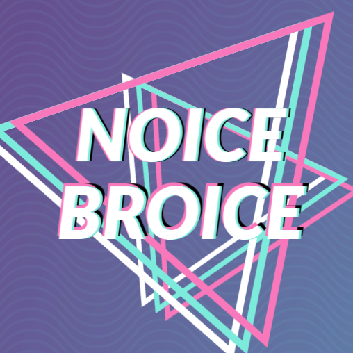
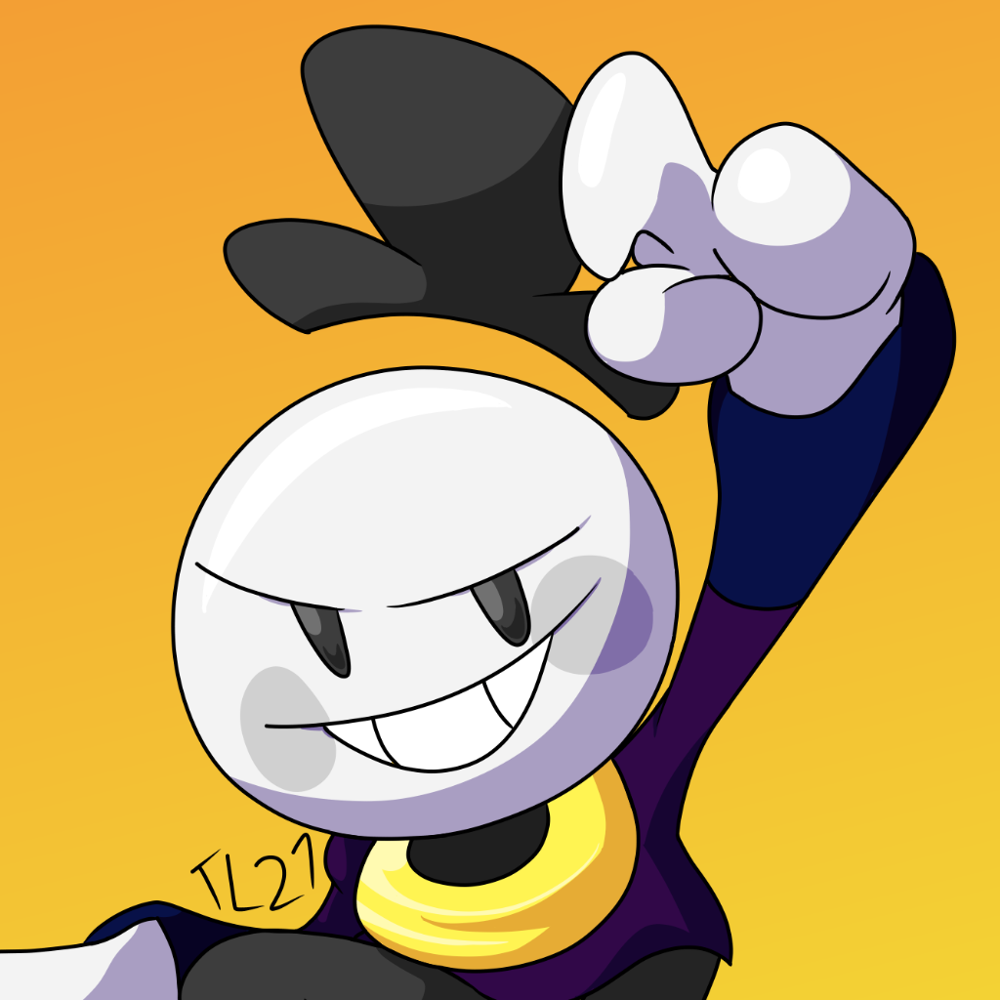
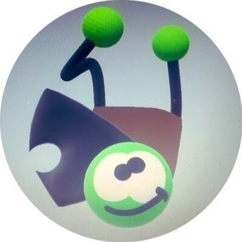

         

       

# Friday Night Funkin': Teddy Twosome
## Teddy Twosome
**Teddy Twosome** is a mod for Friday Night Funkin' built off of Kade Engine.

Links: **[GameBanana mod page](https://gamebanana.com/gamefiles/16761) ⋅ [play in browser](https://funkin.puyo.xyz) ⋅ [latest stable release](https://github.com/KadeDev/Kade-Engine/releases/latest) ⋅ [latest development build (windows)](https://ci.appveyor.com/project/KadeDev/kade-engine-windows/build/artifacts) ⋅ [latest development build (macOS)](https://ci.appveyor.com/project/KadeDev/kade-engine-macos/build/artifacts) ⋅ [latest development build (linux)](https://ci.appveyor.com/project/KadeDev/kade-engine-linux/build/artifacts)**

# Credits
### Mod Creators
<table style="span:90%">
	<tr>
		<th style="text-align:left"><h3>🖥 Coders:</h3></th>
		<th style="text-align:middle"><h3>🖼 Artists:</h3></th>
		<th style="text-align:right"><h3>🎶 Musicians:</h3></th>
	</tr>
	<tr>
	<td>
		<a href='https://twitter.com/NoiceBroice'><b>NoiceBroice</b></a> 
		
	</td>
	<td>
		<a href='https://twitter.com/TheLunar27'><b>TheLunar27</b></a> and <a href='https://twitter.com/evilsk8r'><b>Evilsk8r</b></a> 
		
		 
	</td>
	<td>
		<a href='https://twitter.com/kawaisprite'><b>Kawaisprite</b></a> 
		
	</tr>
</table>

### Kade Engine
- [KadeDeveloper](https://twitter.com/KadeDeveloper) - Maintainer and lead programmer
- [The contributors](https://github.com/KadeDev/Kade-Engine/graphs/contributors)

### Friday Night Funkin'
<!--me lol-->
<table style="span:90%">
	<tr>
		<th style="text-align:left"><h3>🖥 Programmers:</h3></th>
		<th style="text-align:middle"><h3>🖼 Artists:</h3></th>
		<th style="text-align:right"><h3>🎶 Musicians:</h3></th>
	</tr>
	<tr>
	<td>
		<a href='https://twitter.com/NoiceBroice'><b>NoiceBroice</b></a> 
		
	</td>
	<td>
		<a href='https://twitter.com/TheLunar27'><b>TheLunar27</b></a> and <a href='https://twitter.com/evilsk8r'><b>Evilsk8r</b></a> 
		
		 
	</td>
	<td>
		<a href='https://twitter.com/kawaisprite'><b>Kawaisprite</b></a> 
		
	</tr>
</table>

**Friday Night Funkin'** is a rhythm game originally made for Ludum Dare 47 "Stuck In a Loop".

Links: **[itch.io page](https://ninja-muffin24.itch.io/funkin) ⋅ [Newgrounds](https://www.newgrounds.com/portal/view/770371) ⋅ [source code on GitHub](https://github.com/ninjamuffin99/Funkin)**
> Uh oh! Your tryin to kiss ur hot girlfriend, but her MEAN and EVIL dad is trying to KILL you! He's an ex-rockstar, the only way to get to his heart? The power of music... 

This game was made with love to Newgrounds and its community. Extra love to Tom Fulp.
